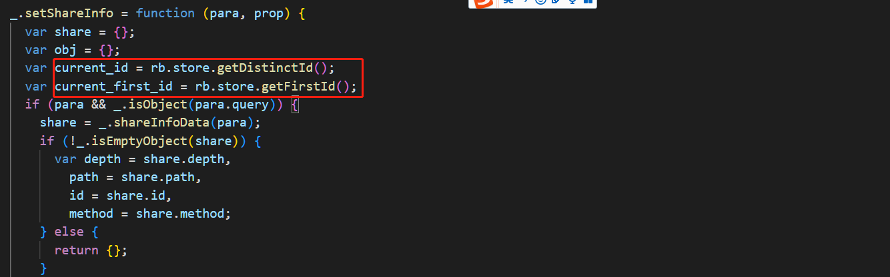

#### 一、页面中采集：

在页面使用sdk提供的方法如下图：

rb是配置初始化参数setPara()时的name值

#### 二、sdk.js中代码逻辑：

__wxConfig、global

##### 1、sdk中执行：initAppProxy，initPageProxy函数

initAppProxy函数中是对注册小程序App的扩展，将rb对象赋值给app.rb，rb见上所述：

monitorApp函数，编写了小程序onShow和onHide生命周期执行后的回调逻辑，执行$MPShow、$MPHide采集事件：

meta：object ，一些状态、数据的初始化：

initPageProxy函数中，编写了页面和组件相关的逻辑，对点击事件及页面周期相关的函数增加了回调处理：

monitorHooks方法中对页面的onLoad、onShow和onAddToFavorites函数增加了执行后的回调逻辑，执行$MPViewScreen、$MPAddFavorites采集事件:

对卸载、离开页面增加了回调逻辑，sendPageLeave()执行$MPPageLeave采集事件：

对页面中分享相关的函数回调逻辑做了处理，执行$MPShare采集事件：

monitorClick方法中对点击事件进行了处理：

**ps：点击事件具体逻辑见【2、点击事件采集逻辑】**

##### 2、点击事件采集逻辑：

查询页面option数据，除去上图meta.mp_hook中的数据，剩余的方法应该是点击事件或其他逻辑处理函数,sdk中对这些方法做了扩展，增加了点击事件采集相关的逻辑，元素触发点击事件，可以获取到当前元素相关信息：

在clickTrack函数中判定是否是点击事件，是则触发点击采集事件，属于点击事件有三种：

##### 3、分享数据采集逻辑：

分享页面的前提是：**只有页面js文件中定义了转发和转发朋友圈事件处理函数，右上角菜单才会显示“转发“按钮，”转发朋友圈“按钮**

分享层级depth：次数是根据share_distinct_id与当前这个人的distinct_id是否一致，不一致在原share.depth+1，一致则share.depth

